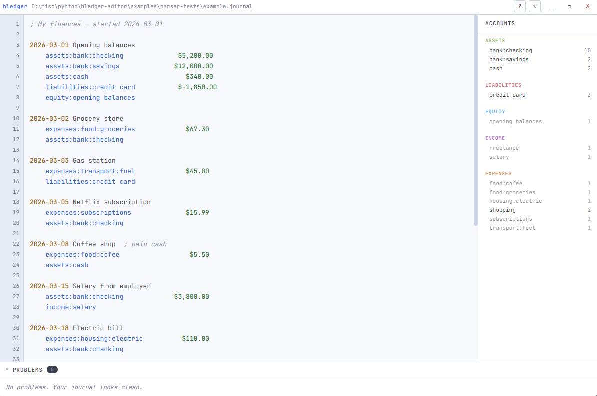
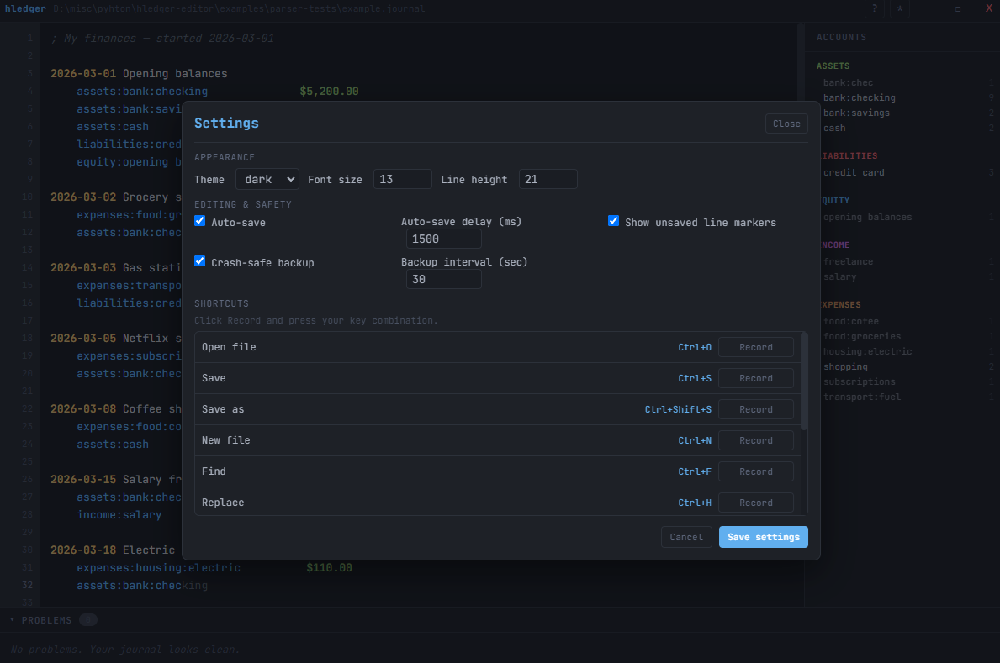

# hledgeditor

A desktop editor for hledger journal files with syntax highlighting and real-time error checking.



## Features

- **Syntax highlighting** — dates, account names, amounts, and comments each get distinct colors
- **Real-time error detection:**
  - Unbalanced transactions
  - Invalid dates
  - Missing postings
  - Multiple inferred amounts
  - Bad indentation
- **Typo detection** — flags accounts used only once that look similar to other accounts, with one-click autocorrect
- **Customizable Theming & Settings** — Dark/Light themes, configurable font sizes, and custom hotkeys mapping
- **Smart Account Autocomplete** — Inline "ghost text" suggestions based on accounts used in your journals, supporting fuzzy/prefix matching
- **Multi-file `include` support** — Automatically resolves and parses `include` files so suggestions and typochecks span your entire ledger
- **Auto-save & Crash Recovery** — Optional background auto-save and continuous crash-safe backups
- **Find, Replace & Go-to-Line** — In-editor search panel with regex support
- **Drag & Drop** — Drag journal files directly into the window to open them
- **Environment Variable Support** — Automatically opens the file pointed to by your `LEDGER_FILE` on startup
- **External change detection** — notifies you if the file is modified by another program (e.g. hledger add)
- **File association** — can be set as the default editor for `.journal` files
- **Accounts sidebar** — shows all accounts grouped by type with usage counts
- **Collapsible problems panel** — three display modes (collapsed / peek / expanded)

## Requirements

- [Node.js](https://nodejs.org/) 18 or later
- npm (comes with Node.js)

## Setup

```bash
# Clone or extract the project, then:
cd hledgeditor
npm install
```

## Development

Run the app in development mode with hot-reload for the renderer:

```bash
npm run dev
```

This starts Vite's dev server and launches Electron once it's ready. Changes to the React code will hot-reload in the app window.

## Building for Windows

To create a distributable `.exe` installer:

```bash
npm run build:win
```

The output will be in the `release/` directory. You'll get an NSIS installer that you can run on any Windows machine — it doesn't require Node.js to be installed.

## Building for other platforms

```bash
npm run build
```

This will build for your current platform. On macOS you'll get a `.dmg`, on Linux an `.AppImage`.



## Usage

### Opening files

- **File > Open** (Ctrl+O) — opens a file picker filtered to `.journal`, `.hledger`, and `.j` files
- **Drag and drop** — Drop journal files anywhere in the editor window to open them
- **Command line** — `hledgeditor myfile.journal` (after building)
- **File association** — after installing, you can set `.journal` files to open with hledgeditor

### Editing

The editor works like any text editor. A few specifics:

- **Autocomplete** — As you type account names, ghost text will suggest existing accounts. Press `Tab`, `Enter`, or `ArrowRight` to accept. Use `ArrowUp` or `ArrowDown` to cycle matches.
- **Tab** inserts 4 spaces (hledger requires space indentation)
- Errors appear in real-time in the problems panel at the bottom
- Click any problem to jump to that line
- Typo warnings have a **Fix** button that renames the account throughout the file
- **Ctrl+F** / **Ctrl+H** for Find and Replace (with regex support)
- **Ctrl+G** for Go To Line
- **Ctrl+Home** / **Ctrl+End** to jump to the start or end of the file

### Saving

- **Ctrl+S** — Save (or Save As if untitled)
- **Ctrl+Shift+S** — Save As
- You'll be prompted to save when closing or opening a new file

### External changes

If another program modifies the file (e.g., you ran `hledger add` in a terminal), a banner appears offering to reload. This prevents you from losing changes made elsewhere.

## Project structure

```
hledgeditor/
├── electron/
│   ├── main.js          # Electron main process (windows, menus, file I/O)
│   ├── preload.js       # Secure IPC bridge
│   └── settings.js      # App settings & defaults management
├── src/
│   ├── index.html       # HTML shell
│   ├── main.jsx         # React entry point
│   ├── App.jsx          # Editor UI component
│   ├── parser.js        # hledger journal parser + highlighter
│   └── themes/          # Light and dark color schemes
├── package.json
├── vite.config.js
└── README.md
```

## How it works

The editor is a React app running in Electron's renderer process. The journal parser (`src/parser.js`) runs on every keystroke, producing:

1. A list of transactions with their postings
2. Errors (structural problems like unbalanced entries)
3. Warnings (likely typos detected via Levenshtein distance)
4. Syntax tokens for highlighting

The Electron main process (`electron/main.js`) handles all file system operations through IPC, keeping the renderer sandboxed and secure.

## Limitations

- This is an editor only — it does not run hledger commands. Use hledger's CLI tools for reports, balance checks, etc.
- Large files (10,000+ lines) may start to feel sluggish since parsing runs on every keystroke. For most personal finance journals this is a non-issue.
- The parser covers common hledger syntax but does not handle every edge case (e.g., auto postings, periodic transactions, commodity directives). These will be ignored rather than flagged as errors.

## License

MIT
